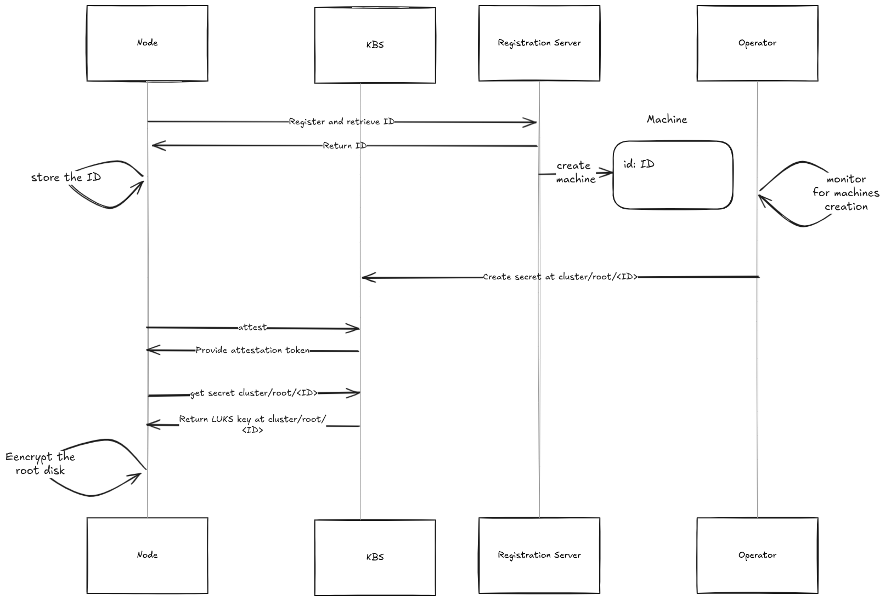

# Boot and attestation process

## Overview

This document describes the booting flow for confidential clusters.

## Architecture Diagram

## The Key Broker Service
The Key Broker Service (KBS) enables identity authentication and authorization through remote attestation, and manages the storage and access control of secret resources

## Confidential Cluster Operator
The Operator is responsible for orchestrating the node attestation in the cluster, creating the register server and configuring the services and creating the secrets for the node.

## Flow Description

### First Boot

1. **Node registration**
	- The node will request an identifier from the register server to fetch an ID at the endpoint `/register`
	- The registration service create a new Machine object associate to the ID
1. **LUKS Key generation**
	- The Operator watches for the machine object creation and use the ID to register the LUKS key associated to the 
      node in the KBS at path `cluster/root/<ID>`
1. **Identifier store**
	- The node creates a new partition with the label IDSTORE and save the identifier in that partition in the `idstore`
      file
1. **Node Attestation**
	- The `AttestationAgent` on `node` initiates the attestation process
	- Evidence is sent to the `KBS` for validation
1. **Evidence Verification**
	- The `Trustee Server` validates the hardware evidence
	- An attestation token is returned to the `AttestationAgent`
1. **Secret release**
	- The node presents its attesttion token and request the secret at path cluster/root/<ID>`
	- The node encrypts its root disk with the LUKS key

### Second Boot

1. **ID retrivial**
	- The node mounts the partition `IDSTORE` and reads the ID from the file `idstore`
1. **Node Attestation**
	- Initiate the attestation as in the first boot
1. **Decryption of the root disk**
	- The node presents its attestation token and request the secret at path cluster/root/<ID>`
	- The node decrypts its root disk with the LUKS key
