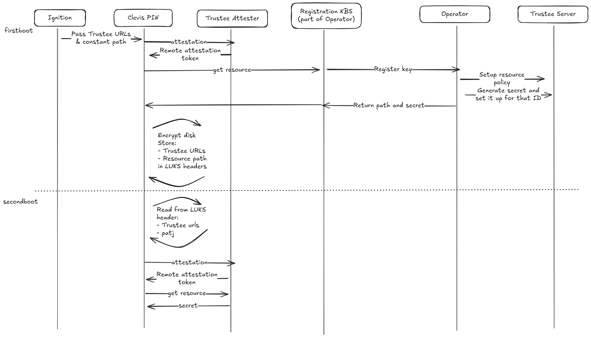

# Boot and attestation process

## Overview

This document describes the booting flow for confidential clusters.

The attestation flow differs from the firstboot when the root disk will be encrypted by the key released after attestation, while on second boot the root disk will be decrypted upon a successful attestation.

For first and second boot, we will use a different model for the KBS.

## RATS Background Models

The Remote ATtestation procedureS (RATS) architecture defines two primary background models:

- **Check Model**: A simple model where the verifier directly validates attestation evidence and returns the result. This model is sufficient for scenarios where the attesting environment already has established credentials.

- **Passport Model**: A more complex model where attestation evidence is first verified by a separate verifier service, which issues an attestation token (passport). This token can then be presented to relying parties as proof of successful attestation.

For this implementation:
- **First boot** uses the **passport model** to generate and retrieve the LUKS key, as the node needs to establish its initial identity and credentials
- **Second boot** uses the simpler **check model** to retrieve the key, as the node already has established credentials from the first boot

## Clevis and Clevis Pins

**Clevis** is a framework for managing encrypted volumes that provides automated decryption of LUKS devices. It works through a plugin system called "pins" that define different methods for retrieving decryption keys.

**Clevis Pins** are plugins that implement specific key retrieval mechanisms. Common pins include:

For this implementation, we will develop a custom **Clevis pin for Trustee** that:
- Triggers the attestation process when decryption is needed
- Handles the communication with KBS services
- Saves attestation metadata in the LUKS header for use during the decryption phase
- Enables seamless integration with the existing Clevis ecosystem

## Clevis Pin Configuration

The Clevis pin configuration defines three categories of servers for different phases of the attestation and encryption process:
- **secret_type**: Indicate that the secret is dynamically provisioned and that the path for the decryption will be released together
                   with the key
- **path**: path to use for obtaining the secret resource. If the secret_type is dynamic then this variable will be overwritten by the 
            path returned with the secret, otherwise if static then this path will written in the LUKS header and used as path for the decryption.
- **attestation**: List of servers for obtaining attestation tokens during the initial attestation process
- **encryption**: List of servers from which to fetch the LUKS key for encrypting the disk during first boot
- **decryption**: List of servers from which to fetch the key for decrypting the disk during subsequent boots

Clevis pin configuration:
```json
{
   "secret_type": "dynamic",
   "path": "default/new-key/root",
   "attestation": {
        "servers": [
         {
           "url":"http://trustee1",
           "cert": "",
         }
         {
           "url":"http://trustee2",
           "cert": "",
         }
    ],
   },
   "encryption": {
        "servers": [
         {
           "url":"http://registration-kbs",
           "cert": "",
         }
    ],
  },
  "decryption": {
        "servers": [
         {
           "url":"http://trustee1",
           "cert": "",
         }
         {
           "url":"http://trustee2",
           "cert": "",
         }
    ],
  }
}
```

## Flow Description

### First Boot
1. **Ignition pass the configuration to the clevis Trustee pin**
    - The clevis pin calls the trustee agent based on the configuration

1. **Trustee Attestation**
	- The trustee attestation agent initiates the attestation process
	- The agent completes attestation and retrieves an attestation token

1. **Registration KBS Contact**
	- The trustee agent contacts the registration KBS with the attestation token

1. **Token Validation and Operator Registration**
	- The registration KBS validates the attestation token
	- The registration KBS contacts the cocl operator at the register service

1. **ID and Key Generation**
	- The operator generates a unique ID and a LUKS key
	- The operator updates the resource policy of the second KBS to match the attestation key with the ID (see #rego-policy)
	- The operator returns the ID and key to the registration KBS

1. **Response to Trustee Agent**
	- The registration KBS responds to the trustee agent with a JSON containing:
		- The path including the ID
		- The key

1. **Secret Registration**
	- Simultaneously, the operator registers the secret in a second KBS at the returned path

1. **JSON Response Processing**
	- The trustee agent receives the JSON response from the registration KBS
	- The JSON contains the path and key for root disk encryption

1. **Root Disk Encryption**
	- The Clevis pin uses the received key to encrypt the root disk
	- The Clevis pin stores metadata in the LUKS header including:
		- The list of attestation servers from the configuration
		- The list of decryption servers from the configuration  
		- The path for fetching the LUKS key during decryption phase (as returned in the JSON)

### Second Boot

1. **LUKS Header Reading**
	- The Clevis pin reads the attestation servers list from the LUKS header

1. **Trustee Attestation**
	- The agent performs attestation and retrieves an attestation token

1. **Key Retrieval and Decryption**
	- The Clevis pin reads the decryption servers list from the LUKS header
	- The pin uses the attestation token to retrieve the key from the decryption servers
	- The pin decrypts the root disk using the retrieved key



## Rego Policy

The following Rego policy validates that the attestation key matches the stored key for the ID extracted from the secret path:

```rego
package policy

default allow = false

data := {
  "registered_nodes": {
    "id-12345": {
      "jwk": {
        "alg": "ES256",
        "kty": "EC",
        "crv": "P-256",
        "x": "377tdLmOB_qul9jDwb1aIyuAOOB1ZsmrTFjbSTLv7J4",
        "y": "uDmb8Y3MgL2P1F5DgcTVVBY1ZVIMi9PHs4mGwaX2BdQ"
      }
    }
  }
}

# Extract ID from the resource path (second element after splitting by '/')
resource_id := split(input.resource_path, "/")[1]

# Get the stored JWK for this ID
stored_jwk := data.registered_nodes[resource_id].jwk

# Extract the attestation key from the token header
token_header := json.unmarshal(base64url.decode(split(input.attestation_token, ".")[0]))
attestation_key := token_header.jwk

# Allow access if the attestation key matches the stored key
allow {
    attestation_key.x == stored_jwk.x
    attestation_key.y == stored_jwk.y
    attestation_key.kty == stored_jwk.kty
    attestation_key.crv == stored_jwk.crv
    attestation_key.alg == stored_jwk.alg
}
```

## Security Considerations

### Attack Vector Prevention

This design prevents a critical attack scenario where one VM could impersonate another VM to access its secrets. Specifically, we want to prevent:

**Attack Scenario**: VM B successfully passes attestation and attempts to request the LUKS key for VM A by using VM A's ID, thereby impersonating VM A to gain unauthorized access to its encrypted disk.

### Key Binding Solution

To mitigate this attack, we implement a key binding mechanism that ties each VM's identity to a cryptographic key:

1. **Key Persistence**: We assume that the key used to sign attestation tokens remains constant and persists across reboots and shutdowns for each VM.

2. **Registration Phase Binding**: During the initial registration phase, we register each generated ID together with the specific key used to sign that VM's attestation token.

3. **Verification on Subsequent Boots**: For all subsequent boots, we release the LUKS key if and only if:
   - The attestation token is valid
   - The attestation token is signed by the exact key that was registered with the requested ID

4. **Resource Policy Enforcement**: The Rego policy enforces this binding by:
   - Extracting the ID from the secret path
   - Retrieving the registered key for that ID
   - Comparing the signing key from the attestation token with the stored key
   - Allowing access only when both keys match exactly

This ensures that even if VM B successfully completes attestation, it cannot access VM A's secrets because VM B's attestation token will be signed with VM B's key, which will not match the key registered for VM A's ID.
